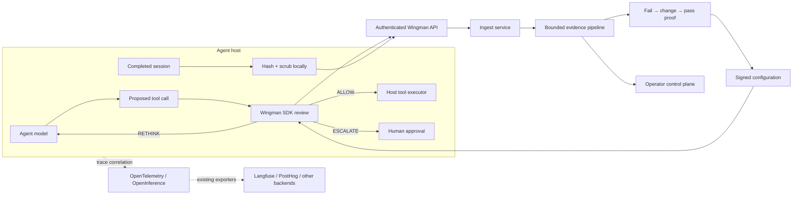

<div align="center">

# Wingman

### Decision review and outcome verification for tool-using AI agents

Wingman sits at the host's tool boundary, catches poorly considered actions before
execution, learns from user friction, and applies only configuration changes that
demonstrably fail before the change and pass afterward.

[](https://github.com/zkortam/wingman/actions/workflows/ci.yml)
[](https://www.npmjs.com/package/@zkortam/wingman-sdk)
[](package.json)
[](tsconfig.base.json)
[](LICENSE)

[Architecture](docs/ARCHITECTURE.md) · [Integration guide](docs/INTEGRATIONS.md) ·
[Security](.github/SECURITY.md) · [Contributing](.github/CONTRIBUTING.md) ·
[Changelog](CHANGELOG.md)

Built by **Zakaria Kortam** and **Ali Alani**.

</div>

> [!IMPORTANT]
> Wingman is pre-1.0. Install [`@zkortam/wingman-sdk`](https://www.npmjs.com/package/@zkortam/wingman-sdk)
> (`@wingman` is already an npm organization). Use **0.1.2 or newer**. In this repository the
> workspace packages remain `@wingman/sdk` and `@wingman/schema`.

## Who this is for

Teams that ship tool-using agents and cannot wait for a thumbs-down. If you
already intercept tool calls (MCP client, LangChain tool middleware, Vercel AI
SDK `onToolCall`, OpenAI Agents hooks), Wingman is a library you drop in front
of the executor. If your framework cannot intercept tools, you can still
observe sessions — you cannot honestly claim a pre-execution guard.

Wingman is not a tracer, a prompt playground, or a sandbox. Hosts still
authorize tools and approve destructive actions.

## What Wingman does

AI agents often produce actions that are syntactically valid but poorly reasoned:
using the wrong tool, dropping a user constraint, ignoring current UI state, or
repeating an operation the user has already rejected. Conventional tracing records
the mistake after it happens. Wingman adds a control point before execution and an
evidence pipeline after the session.

| Capability              | Behavior                                                                                                |
| ----------------------- | ------------------------------------------------------------------------------------------------------- |
| Tool-call review        | Returns `ALLOW`, `RETHINK`, or `ESCALATE` before the host executes a proposed tool call.                |
| User-friction detection | Detects retries, restated constraints, abandonment, and expectation mismatches from redacted sessions.  |
| Verified repair         | Requires the same assertion to fail before a candidate change and pass after it.                        |
| Safe rollout            | Applies signed, bounded configuration versions to one user or globally, with confirmation and rollback. |
| Privacy-first evidence  | HMAC-pseudonymizes user IDs and scrubs allowlisted text and arguments inside the agent host.            |
| Operator control        | Provides incident proof, apply, dismiss, reopen, handoff, confirmation, and revert workflows.           |

## Core guarantees

- Wingman never executes customer tools. The host remains the only executor.
- Nothing is applied without fail-before and pass-after evidence.
- Replays are model-only. The callback is not given an executor, and a nonzero
  `toolExecutions` count is rejected.
- Configuration is signed, schema-validated, writable-path constrained, and
  byte-capped, and a stale signed payload cannot reinstate a superseded policy.
- Configuration outages resolve through last-known-good and compiled-base fallbacks.
- Pipeline stages are bounded, and repeating a write with the same result is a no-op.
  A replay whose sampled result differs parks the incident rather than overwriting
  evidence, and exhausted work parks instead of looping.
- Production operator and machine endpoints use separate credentials and fail closed.
- Demo and fixture code are dependency leaves and cannot enter production packages.

## Architecture



The synchronous control plane and asynchronous evidence plane are deliberately
separate. Observability is valuable evidence, but it is not a reliable pre-execution
guard.

## Install

```bash
npm install @zkortam/wingman-sdk
```

That pulls [`@zkortam/wingman-schema`](https://www.npmjs.com/package/@zkortam/wingman-schema)
with it, and nothing else: the SDK has no third-party runtime dependencies. Do
not deep-import `services/*`.

### Agent-host environment

Set these in the process that runs your agent, not in the browser:

| Variable               | Used by                                              |
| ---------------------- | ---------------------------------------------------- |
| `WINGMAN_URL`          | SDK `endpoint`. HTTPS required except loopback.      |
| `WINGMAN_API_KEY`      | Bearer token for review, observe, and config.        |
| `WINGMAN_ORG_ID`       | Organization UUID stamped on observed sessions.      |
| `WINGMAN_ORG_SALT`     | HMAC salt; raw user IDs never leave the host.        |
| `WINGMAN_SIGNING_KEY`  | Verifies signed config from the control plane.       |
| `WINGMAN_AGENT_ID`     | Default agent UUID for review and config.            |
| `WINGMAN_RUNNER_TOKEN` | Bearer token for the host's model-only replay route. |

The control plane uses `WINGMAN_API_URL` for its own origin (demo reset, local
links). An agent on the same machine sets `WINGMAN_URL` to that same origin.

## Repository quick start

Requirements: Node.js 22.18 or newer and pnpm 10. Docker is optional; it is what
lets the persistence tests run against a real Postgres.

```bash
git clone https://github.com/zkortam/wingman.git
cd wingman
pnpm install --frozen-lockfile
pnpm check
```

Run the isolated integration environment:

```bash
pnpm demo:reset
pnpm demo:up
```

Run against a real database:

```bash
pnpm db:up        # Postgres 17 with pgvector, via docker compose
pnpm db:migrate   # apply db/migrations
pnpm test         # the repository contract now runs against real SQL too
```

The operator demo is available only when `WINGMAN_RUNTIME=demo`; production
requests to `/demo` return 404. See [DEMO.md](docs/DEMO.md).

## Integrate an agent host

The primary integration is `@zkortam/wingman-sdk`. It belongs inside the host,
immediately before the host's tool executor—not as a tool the model may choose to
call.

```ts
import { Wingman } from '@zkortam/wingman-sdk'

const wingman = Wingman.init({
  endpoint: process.env.WINGMAN_URL!,
  apiKey: process.env.WINGMAN_API_KEY!,
  orgId: process.env.WINGMAN_ORG_ID!,
  orgSalt: process.env.WINGMAN_ORG_SALT!,
  signingKey: process.env.WINGMAN_SIGNING_KEY!,
  defaultAgent: process.env.WINGMAN_AGENT_ID!,
  baseConfig: {
    systemPrompt: 'You are a careful operations assistant.',
    tools: {
      export_records: {
        description: "Export records using the caller's active filters.",
      },
    },
    retrieval: {},
    rules: [],
  },
  writable: ['rules', 'tools.*.description'],
  redact: { fields: ['turns', 'lastQuery', 'viewFilters'] },
  config: { timeoutMs: 1_000 },
})
```

### 1. Review before execution

```ts
const decision = await wingman.reviewToolCall({
  sessionId,
  userId,
  userMessage: latestUserMessage,
  proposedCall: { name: proposedCall.name, args: proposedCall.args ?? {} },
  recentTurns: recentTurns.map((turn, idx) => ({
    idx,
    role: turn.role,
    textRedacted: turn.text,
    toolCalls: turn.toolCalls ?? [],
    createdAt: turn.createdAt,
  })),
  context,
})

switch (decision.action) {
  case 'ALLOW':
    await executeInYourHost(proposedCall)
    break
  case 'RETHINK':
    await askAgentToReconsider(decision.instruction)
    break
  case 'ESCALATE':
    await requestHumanApproval(decision.reason)
    break
}
```

Review failures are fail-open by default so Wingman cannot take down the host agent.
High-risk integrations can set `review: { failMode: "closed" }`.

Because failures are contained, they are also reported. Pass `onDiagnostic` to
tell a genuine approval apart from a guardrail that has quietly stopped running:

```ts
Wingman.init({
  // ...
  onDiagnostic: (event) => {
    // code is one of UNAUTHORIZED, UNAVAILABLE, TIMEOUT, INVALID_INPUT,
    // INVALID_RESPONSE, CONFIG_REJECTED, CONFIG_FALLBACK,
    // STORAGE_UNAVAILABLE, EVIDENCE_DROPPED.
    logger.warn({ stage: event.stage, code: event.code }, event.message)
  },
})
```

A rotated API key that missed one deployment produces `UNAUTHORIZED` on every
review rather than a silent stream of `ALLOW`.

### 2. Observe a completed session

```ts
wingman.observeSession({
  id: sessionId,
  userId,
  startedAt,
  endedAt,
  turns: turns.map((turn, idx) => ({
    idx,
    role: turn.role,
    text: turn.text,
    toolCalls: turn.toolCalls,
    createdAt: turn.createdAt,
  })),
  telemetry: {
    convention: 'opentelemetry-genai',
    traceId: activeSpan.spanContext().traceId,
    spanId: activeSpan.spanContext().spanId,
  },
})

await wingman.flush()
console.log(wingman.observationStats())
```

Invalid observations and delivery failures are contained and counted; they do not
throw into the agent's request path.

### 3. Resolve signed configuration

```ts
const config = await wingman.config({ agent: agentId, userId })
```

Resolution order is remote signed config → last-known-good local config → compiled
base config. Reads are cached and concurrent cold starts are coalesced. Configure
`config.timeoutMs` using measured service latency.

### 4. Expose model-only replay

```ts
import { createAgentReplayHandler } from '@zkortam/wingman-sdk'

export const POST = createAgentReplayHandler({
  token: process.env.WINGMAN_RUNNER_TOKEN!,
  run: ({ config, messages, context, sample }) =>
    runModelWithoutExecutingTools({ config, messages, context, sample }),
})
```

The callback receives no tool executor. The service connects using
`WINGMAN_RUNNER_ENDPOINT` and a distinct `WINGMAN_RUNNER_TOKEN`.

## MCP and agent frameworks

MCP clients can translate an intercepted JSON-RPC `tools/call` request through
`reviewMcpToolCall` before forwarding it to the MCP server. Invalid MCP envelopes
follow the host `review.failMode`. LangChain, Vercel AI SDK, and OpenAI Agents hosts
can use `createToolMiddleware(wingman)` as a dependency-free before-tool translation.
A2A, AG-UI, and proprietary gateways use the same rule: integrate at their before-tool
middleware or hook. A framework without that hook can be observed, but cannot honestly
be guarded before execution.

Wingman preserves OpenTelemetry/OpenInference trace correlation without installing a
second tracer or copying raw vendor spans. Existing Langfuse and PostHog exporters
continue independently. See [INTEGRATIONS.md](docs/INTEGRATIONS.md) for the connector and
observability contract.

## Production deployment

Wingman stores everything in Postgres and connects with a driver, not a hosted
platform SDK. Any Postgres 14 or newer works - managed, self-hosted, or Supabase -
provided the `pgcrypto` and `vector` extensions are available. Set
`DATABASE_URL`; on a serverless platform run one connection per invocation behind
a pooler such as pgBouncer, RDS Proxy, or Neon.

1. Apply `db/migrations` with `pnpm db:migrate` (it records what it has run and
   is safe to repeat). Migrations are append-only.
2. Seed one org, agent, and BASE config. `pnpm bootstrap-config` prints the
   INSERT statements and the matching agent-host env. Details:
   [DATA-MODEL.md](docs/DATA-MODEL.md) §11.
3. Configure the variables in [.env.example](.env.example) with distinct credentials
   for SDK traffic, operators, Inngest, replay, Postgres, model providers, and handoff.
4. Deploy `apps/web`; it serves the operator UI, authenticated SDK endpoints, and
   `/api/inngest`.
5. Install the SDK in every agent host and expose the private model-only replay route.
6. Exercise the deployment checklist in [INTEGRATIONS.md](docs/INTEGRATIONS.md) before
   enabling apply permissions.

Machine endpoints:

| Endpoint                          | Purpose                                        |
| --------------------------------- | ---------------------------------------------- |
| `POST /v1/reviews/tool-calls`     | Synchronous proposed-tool review.              |
| `POST /v1/events`                 | Redacted session evidence ingestion.           |
| `GET /v1/config/:agent/:userHash` | Signed configuration resolution.               |
| `POST /api/inngest`               | Authenticated asynchronous pipeline execution. |

The Settings page reports only configured/not-configured readiness. It never renders
credential values. Backend outages produce explicit safe UI states and stable 503 API
responses.

## Project layout

```text
packages/schema    Runtime-validated wire contracts and frozen ports
packages/sdk       Public host integration package
packages/db        Postgres connection, row types, and migrations runner
services/config    Signed configuration resolution and versioning
services/ingest    Redaction verification and idempotent persistence
services/pipeline  Detection, proof, repair, rollout, confirmation, rollback
apps/web           Operator control plane and production API composition root
fixtures           Deterministic contract and pipeline integration fixtures
demo               Isolated customer integration environment
db                 Append-only database migrations
```

Production packages cannot import from `demo` or `fixtures`. Configuration cannot
import the pipeline, and the web application performs no direct database writes.

## Quality and release gates

```bash
pnpm check
```

The release gate runs:

- formatting;
- strict workspace typechecking and linting;
- dependency and import-boundary enforcement;
- UI contrast and design-policy validation;
- colocated unit and integration suites, including the repository contract run
  against a real Postgres whenever Docker or `DATABASE_URL` is available;
- deterministic pipeline fixtures;
- public package and production application builds;
- inspection of the tarballs as they are actually published; and
- installation and import from a clean consumer project.

Useful focused commands:

```bash
pnpm test:pipeline   # pipeline units plus deterministic replay fixtures
pnpm coverage        # the suite with the coverage thresholds enforced
pnpm format          # apply repository formatting
pnpm build           # public packages and production Next.js application
pnpm package:check   # pack and import the published SDK/schema as a consumer
```

CI runs the gate on Linux, Windows, and macOS and on Node 22 and 24, performs a
frozen-lock installation, enforces coverage thresholds, and fails on
high-severity dependency advisories. Publishing runs the whole gate again and
refuses to publish a version that does not match the git tag.

## Documentation

| Document                                         | Purpose                                                       |
| ------------------------------------------------ | ------------------------------------------------------------- |
| [ARCHITECTURE.md](docs/ARCHITECTURE.md)          | Boundaries, invariants, failure semantics, and lifecycle.     |
| [INTEGRATIONS.md](docs/INTEGRATIONS.md)          | SDK, MCP, A2A, observability, replay, and vendor coexistence. |
| [DATA-MODEL.md](docs/DATA-MODEL.md)              | Persistence ownership, state, and migration contract.         |
| [DEMO.md](docs/DEMO.md)                          | Operator and Amazoff demos, fixtures, cassettes.              |
| [UI-SPEC.md](docs/UI-SPEC.md)                    | Operator interaction and visual policy.                       |
| [SECURITY.md](.github/SECURITY.md)               | Vulnerability reporting and deployment responsibilities.      |
| [CONTRIBUTING.md](.github/CONTRIBUTING.md)       | Development, compatibility, and pull-request requirements.    |
| [CODE_OF_CONDUCT.md](.github/CODE_OF_CONDUCT.md) | Community standards.                                          |
| [CHANGELOG.md](CHANGELOG.md)                     | Public package history.                                       |

## Contributing

Issues and pull requests are welcome. Start with [CONTRIBUTING.md](.github/CONTRIBUTING.md).
The product gate is `pnpm check`. Architecture questions belong in
[ARCHITECTURE.md](docs/ARCHITECTURE.md), not in a new abstraction.

## Authors

Wingman is built by **Zakaria Kortam** and **Ali Alani**.

## License

Wingman is available under the [MIT License](LICENSE).
